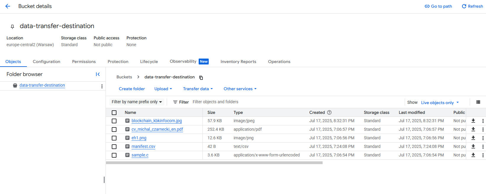

# 🌐 Multi‑Cloud Storage & Data Transfer

This project demonstrates how to **configure and automate data transfer** between **AWS S3** and **Google Cloud Storage**.

Advantages of this solution:
- **Higher reliability** – If AWS has an outage, GCP can keep your apps running and have a copy of your data.
- **More flexibility** – You can make the most of each provider's different strengths. For example, AWS is best known for their compute services, and GCP for their data/AI services.
- **Cost savings** – Since pricing varies across cloud platforms, multi-cloud lets you optimize on costs.


---

## ✅ Overview

- **Goal:** Automatically move files from an AWS S3 bucket to a GCP Cloud Storage bucket.
- **Stack:**
  - AWS (S3)
  - GCP (Cloud Storage)

---

## 🧩 Architecture Diagram


---

## 🚀 Getting Started

### Prerequisites

- AWS admin account
- GCP admin account

---

## Steps

### Creating S3 bucket and uploading files (aws)

Amazon S3 is AWS service for storing objects. It's highly scalable and reliable place to store files of any type and size in the cloud.


### Creating new AWS IAM Role (aws)

Will need in next step, following [gcp documentation](https://cloud.google.com/storage-transfer/docs/source-amazon-s3#federated_identity).


### Creating transfer job in Storage Transfer Service (gcp)

Storage Transfer Service is a Google Cloud service designed for transferring data in and out of GCP Cloud Storage. It handles authentication between the two platforms, start and stop the transfer, and makes sure data transfers correctyly.


In this concrete case I choose batch as scheduling mode as this environment will be turn off after done.

For authentication I will choose AWS IAM role for identity federation which I created earlier, because federation acces is temporary. AWS grants STS short lived credentials (15-60 minutes) for each session.


Then I have to create new cloud storage bucket.


Next, I pass rest of settings default and create job


At the end I will move to cloud storage to check if migration passed successfully


---

### Migrate data using manifest file

Another way to migrate data is using manifest.csv file. To do it i have to upload more files to S3 and create `manifest.csv`


##### manifest.csv
```csv
TsvHttpData-1.0
blockchain_kbkinfocom.jpg
```

Then head back to gcp and upload `manifest.csv` manually. After this create transfer job using `transfer data in`


In summary I checked manifest file checkbox


After couple seconds I can see file described in manifest file in cloud storage migrated correctly.


